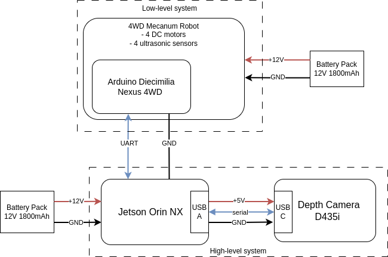

# Mecanum 4WD - Embedded Systems 2 - AGH - 2023/2024

Repository for the high-level and low-level control system for a 4WD mecanum car. Developed for the "Embedded Systems 2" class in the Cyber-Physical Systems specialization for Automation and Robotics, Faculty of Electrical Engineering, Automatics, Computer Science and Biomedical Engineering.

## Systems
Project consists of two systems:
 - high-level system - responsible for:
   - object detection,
   - path planning,
   - calculating and sending commands to the low-level system.
 
 - low-level system - responsible for:
   - receiving commands from the high-level system,
   - controlling the motors of the robot accordingly to the received commands,
   - applying the PID control to the motors.

Basic schematic of both of the systems, and the communication between them, is presented below:



### Tech stack

High-level system:
 - ROS Noetic (ROS1)
 - Language of implementation: C++

Low-level system:
 - Toolset: PlatformIO
 - Framework: Arduino
 - Language of implementation: C++

### Hardware

High-level system:
 - Jetson Orin NX
 - Intel Realsense Depth Camera D435i

Low-level system:
 - Arduino Diecimila (ATmega328P)

## Documentation

Documentation for both of the systems can be generated using Docsify tool. To generate the documentation refer to [this](doc_generation.md) document.

## How to work with this repository?

To start working, clone the repository by running: 
```sh
git clone --recurse-submodules git@github.com:autonomous-embedded/mecanum-integration.git
```
in case `--recurse-submodules` was forgotten:
```sh
# after clone...
git submodule init
git submodule update
```

After you've cloned this repository, you can start working with the source code & the documentation we have. You'll probably need to install some dependencies.

## Dependencies

### High-level system

For the high-level system, required dependencies are:
 - ROS Noetic,
 - librealsense.

As an OS for the high-level system, we recommend Ubuntu 20.04 LTS since anything else has not been supported in this repo. Ever. And probably won't be.

### Low-level system

For the low-level system, required dependency is:
 - PlatformIO.
